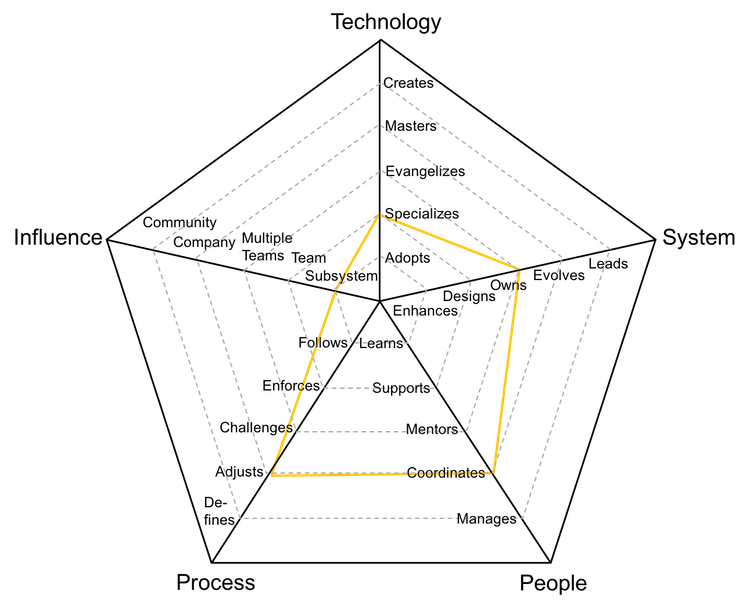

# Líder Funcional

Também conhecido como líder de equipe ou coordenador técnico, é responsável por processos, sistemas ou fluxos, equilibrando execução prática, conhecimento arquitetural ou metodológico e suporte operacional.

| Nível | Sênior |                       Posição                       |
| :---: | :----: | :-------------------------------------------------: |
|   4   |  Sim   | [LF4 - Líder Funcional 4](#lf4---líder-funcional-4) |
|   5   |  Sim   | [LF5 - Líder Funcional 5](#lf5---líder-funcional-5) |
|   6   |  Sim   | [LF6 - Líder Funcional 6](#lf6---líder-funcional-6) |
|   7   |  Sim   | [LF7 - Líder Funcional 7](#lf7---líder-funcional-7) |

## LF4 - Líder Funcional 4

<picture>
  
</picture>

- **Especializa-se**: torna-se a referência para uma ou mais ferramentas, metodologias ou tecnologias, e busca aprender novas.
- **Assume**: é responsável pela operação, monitoramento e métricas de desempenho dos sistemas ou processos.
- **Coordena**: organiza membros da equipe, fornecendo feedback efetivo e moderando discussões.
- **Ajusta**: adapta os processos da equipe, ouvindo feedbacks e orientando mudanças.
- **Área**: impacta diretamente uma área ou subsistema específico.

## LF5 - Líder Funcional 5

<picture>
  
</picture>

- **Evangeliza**: pesquisa, cria provas de conceito e introduz novas ferramentas, práticas ou metodologias para a equipe.
- **Evolui**: ajusta a arquitetura ou fluxos para atender a necessidades futuras e define métricas de sucesso.
- **Coordena**: organiza membros da equipe, fornecendo feedback efetivo e moderando discussões.
- **Define**: estabelece processos adequados ao nível de maturidade da equipe, equilibrando agilidade e disciplina.
- **Equipe**: impacta toda a equipe, não apenas partes específicas dela.

## LF6 - Líder Funcional 6

<picture>
  
</picture>

- **Domina**: possui conhecimento profundo sobre toda a metodologia, tecnologia ou ferramentas da área.
- **Lidera**: conduz a excelência técnica ou operacional, criando planos para mitigar falhas e gargalos.
- **Coordena**: organiza membros da equipe, fornecendo feedback efetivo e moderando discussões.
- **Define**: estabelece processos adequados ao nível de maturidade da equipe, equilibrando agilidade e disciplina.
- **Múltiplas Equipes**: impacta não só sua equipe, mas também outras equipes ou áreas relacionadas.

## LF7 - Líder Funcional 7

<picture>
  
</picture>

- **Domina**: possui conhecimento profundo sobre toda a metodologia, tecnologia ou ferramentas da área.
- **Lidera**: conduz a excelência técnica ou operacional, criando planos para mitigar falhas e gargalos.
- **Coordena**: organiza membros da equipe, fornecendo feedback efetivo e moderando discussões.
- **Define**: estabelece processos adequados ao nível de maturidade da equipe, equilibrando agilidade e disciplina.
- **Organização**: impacta toda a organização em sua área de atuação.

# Outras Páginas

- [**Introdução**](README.md)
- [**Especialista de Domínio**](Specialist.md)
- [**Coordenador de Programas**](ProgramCoordinator.md)
- [**Gestor de Equipe**](TeamManager.md)
- [**Líder Funcional vs Gestor de Equipe**](FunctionalLead-TeamManager.md)
- [**Gerenciando Gestores**](Managing-Managers.md)
