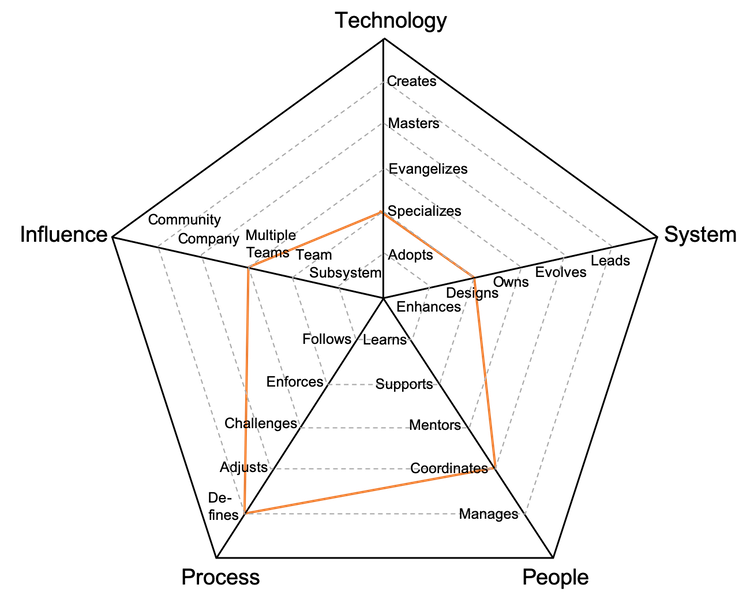

# Coordenador de Programas

Responsável por coordenar e liderar iniciativas que abrangem múltiplas equipes ou áreas, garantindo sua conclusão com sucesso.

| Nível | Sênior |                                Posição                                |
| :---: | :----: | :-------------------------------------------------------------------: |
|   4   |  Sim   | [CP4 - Coordenador de Programas 4](#cp4---coordenador-de-programas-4) |
|   5   |  Sim   | [CP5 - Coordenador de Programas 5](#cp5---coordenador-de-programas-5) |
|   6   |  Sim   | [CP6 - Coordenador de Programas 6](#cp6---coordenador-de-programas-6) |
|   7   |  Sim   | [CP7 - Coordenador de Programas 7](#cp7---coordenador-de-programas-7) |

## CP4 - Coordenador de Programas 4

<picture>
  
</picture>

- **Especializa-se**: torna-se a referência em uma ou mais ferramentas, metodologias ou tecnologias e busca aprender novas.
- **Projeta**: projeta e implementa soluções de médio a grande porte, reduzindo débitos técnicos ou operacionais.
- **Coordena**: organiza as equipes, fornecendo feedback eficaz e moderando discussões.
- **Ajusta**: adapta os processos da equipe ou das equipes, ouvindo feedbacks e orientando mudanças.
- **Múltiplas Equipes**: impacta não apenas a equipe principal, mas também outras equipes envolvidas.

## CP5 - Coordenador de Programas 5

<picture>
  
</picture>

- **Especializa-se**: torna-se a referência em uma ou mais ferramentas, metodologias ou tecnologias e busca aprender novas.
- **Projeta**: projeta e implementa soluções de médio a grande porte, reduzindo débitos técnicos ou operacionais.
- **Coordena**: organiza as equipes, fornecendo feedback eficaz e moderando discussões.
- **Define**: estabelece os processos adequados ao nível de maturidade das equipes, equilibrando agilidade e disciplina.
- **Múltiplas Equipes**: impacta não apenas a equipe principal, mas também outras equipes envolvidas.

## CP6 - Coordenador de Programas 6

<picture>
  
</picture>

- **Especializa-se**: torna-se a referência em uma ou mais ferramentas, metodologias ou tecnologias e busca aprender novas.
- **Assume**: é responsável pela operação, monitoramento e cumprimento das métricas dos sistemas ou processos.
- **Gerencia**: gerencia a carreira, expectativas, desempenho e satisfação das equipes.
- **Define**: estabelece os processos adequados ao nível de maturidade das equipes, equilibrando agilidade e disciplina.
- **Organização**: impacta toda a organização em sua área de atuação.

## CP7 - Coordenador de Programas 7

<picture>
  
</picture>

- **Especializa-se**: torna-se a referência em uma ou mais ferramentas, metodologias ou tecnologias e busca aprender novas.
- **Evolui**: ajusta a arquitetura ou fluxos para atender a necessidades futuras e define métricas de sucesso.
- **Gerencia**: gerencia a carreira, expectativas, desempenho e satisfação das equipes.
- **Define**: estabelece os processos adequados ao nível de maturidade das equipes, equilibrando agilidade e disciplina.
- **Comunidade**: impacta a comunidade externa em sua área de atuação.

# Outras Páginas

- [**Introdução**](README.md)
- [**Especialista de Domínio**](Specialist.md)
- [**Líder Funcional**](FunctionalLead.md)
- [**Gestor de Equipe**](TeamManager.md)
- [**Líder Funcional vs Gestor de Equipe**](FunctionalLead-TeamManager.md)
- [**Gerenciando Gestores**](Managing-Managers.md)
