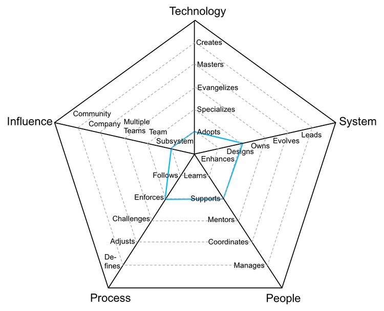
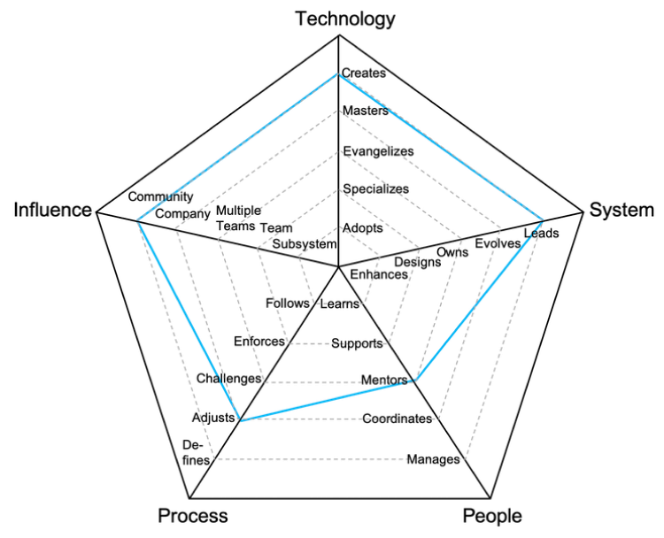

# Especialista de Domínio

Papel também conhecido como especialista técnico, analista ou desenvolvedor, exige um alto nível de especialização em sua área de atuação.

| Nível | Sênior |                              Posição                              |
| :---: | :----: | :---------------------------------------------------------------: |
|   1   |  Não   | [N1 - Especialista de Domínio 1](#n1---especialista-de-domínio-1) |
|   2   |  Não   | [N2 - Especialista de Domínio 2](#n2---especialista-de-domínio-2) |
|   3   |  Não   | [N3 - Especialista de Domínio 3](#n3---especialista-de-domínio-3) |
|   4   |  Sim   | [N4 - Especialista de Domínio 4](#n4---especialista-de-domínio-4) |
|   5   |  Sim   | [N5 - Especialista de Domínio 5](#n5---especialista-de-domínio-5) |
|   6   |  Sim   | [N6 - Especialista de Domínio 6](#n6---especialista-de-domínio-6) |
|   7   |  Sim   | [N7 - Especialista de Domínio 7](#n7---especialista-de-domínio-7) |

## N1 - Especialista de Domínio 1

<picture>
  
</picture>

- **Adota**: aprende e utiliza ativamente as ferramentas, processos ou metodologias definidas pela equipe.
- **Melhora**: entrega novas funcionalidades ou melhorias que aprimoram os sistemas ou processos.
- **Aprende**: aprende rapidamente com os outros e assume responsabilidades quando necessário.
- **Segue**: segue os processos da equipe, garantindo a entrega consistente de resultados.
- **Área**: impacta diretamente uma área ou subsistema específico.

## N2 - Especialista de Domínio 2

<picture>
  
</picture>

- **Adota**: aprende e utiliza ativamente as ferramentas, processos ou metodologias definidas pela equipe.
- **Projeta**: projeta e implementa soluções de médio porte, reduzindo débitos técnicos ou operacionais.
- **Apoia**: oferece suporte proativo aos membros da equipe, ajudando-os a alcançar o sucesso.
- **Encoraja**: promove os processos da equipe, destacando seus benefícios e limitações.
- **Área**: impacta diretamente uma área ou subsistema específico.

## N3 - Especialista de Domínio 3

<picture>
  
</picture>

- **Especializa-se**: torna-se referência em uma ou mais tecnologias, ferramentas ou metodologias, e busca aprender novas.
- **Projeta**: projeta e implementa soluções de médio a grande porte, reduzindo débitos técnicos ou operacionais.
- **Apoia**: oferece suporte proativo aos membros da equipe, ajudando-os a alcançar o sucesso.
- **Desafia**: questiona os processos da equipe, buscando formas de melhorá-los.
- **Equipe**: impacta toda a equipe, e não apenas partes específicas dela.

## N4 - Especialista de Domínio 4

<picture>
  
</picture>

- **Evangeliza**: pesquisa, cria provas de conceito e introduz novas práticas, ferramentas ou tecnologias à equipe.
- **Assume**: é responsável pela operação e monitoramento de sistemas ou processos, garantindo metas de desempenho.
- **Orienta**: orienta outros para acelerar seu crescimento profissional e incentiva sua participação.
- **Desafia**: questiona os processos da equipe, buscando formas de melhorá-los.
- **Equipe**: impacta toda a equipe, e não apenas partes específicas dela.

## N5 - Especialista de Domínio 5

<picture>
  
</picture>

- **Domina**: possui conhecimento profundo sobre todo o stack técnico ou metodologia da área.
- **Evolui**: adapta a arquitetura ou processos para atender a requisitos futuros e define metas de desempenho.
- **Orienta**: orienta outros para acelerar seu crescimento profissional e incentiva sua participação.
- **Ajusta**: ajusta os processos da equipe, ouvindo feedbacks e orientando mudanças.
- **Múltiplas Equipes**: impacta não só sua equipe, mas também outras equipes.

## N6 - Especialista de Domínio 6

<picture>
  
</picture>

- **Cria**: projeta e desenvolve novas tecnologias, metodologias ou processos amplamente utilizados interna ou externamente.
- **Lidera**: lidera a excelência técnica ou operacional, criando planos para evitar falhas.
- **Orienta**: orienta outros para acelerar seu crescimento profissional e incentiva sua participação.
- **Ajusta**: ajusta os processos da equipe, ouvindo feedbacks e orientando mudanças.
- **Organização**: impacta toda a organização em sua área de atuação.

## N7 - Especialista de Domínio 7

<picture>
  
</picture>

- **Cria**: projeta e desenvolve novas tecnologias, metodologias ou processos amplamente utilizados interna ou externamente.
- **Lidera**: lidera a excelência técnica ou operacional, criando planos para evitar falhas.
- **Orienta**: orienta outros para acelerar seu crescimento profissional e incentiva sua participação.
- **Ajusta**: ajusta os processos da equipe, ouvindo feedbacks e orientando mudanças.
- **Comunidade**: impacta a comunidade externa em sua área de atuação.

# Outras Páginas

- [**Introdução**](README.md)
- [**Líder Funcional**](FunctionalLead.md)
- [**Coordenador de Programas**](ProgramCoordinator.md)
- [**Gestor de Equipe**](TeamManager.md)
- [**Líder Funcional vs Gestor de Equipe**](FunctionalLead-TeamManager.md)
- [**Gerenciando Gestores**](Managing-Managers.md)
